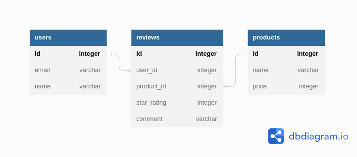

# Product Reviews
This is a sample Ruby on Rails application that demonstrates a basic implementation of a product review system. Users can create products, leave reviews, and view reviews for a particular product. The application also allows users to delete their own reviews and view their favorite products based on the average star rating of their reviews.

##  Domain/Entity Relationship Diagram

## Setup
To run this application, you will need to have Ruby and Ruby on Rails installed on your machine. Once you have those installed, follow these steps:

1. Clone the repository to your local machine using the command git clone https://github.com/Wattima/product_reviews.git.
2. Navigate to the project directory using the command cd product_reviews.
3. Run bundle install to install all required dependencies.
4. Run rake db:create to create the database.
5. Run rake db:migrate to run the database migrations.
6. Run rake db:seed to seed the database with sample data.
7. Use rake console to test the app's functionality.

## Object Association Methods
The app uses Active Record association macros and Active Record query methods to establish relationships between users, products, and reviews.

## Review
1. Review#user: returns the User instance for this Review
2. Review#product: returns the Product instance for this Review
## Product
1. Product#reviews: returns a collection of all the Reviews for the Product
2. Product#users: returns a collection of all the Users who reviewed the Product
## User
1. User#reviews: returns a collection of all the Reviews that the User has given
2. User#products: returns a collection of all the Products that the User has reviewed
3. Use the Rails console (rails console) to check that these methods work before proceeding.

# Aggregate and Association Methods
The app provides several methods to aggregate and associate reviews with products and users.

## Review
Review#print_review: prints a string formatted as follows: Review for {insert product name} by {insert user name}: {insert review star_rating}. {insert review comment}
## Product
1. Product#leave_review(user, star_rating, comment): creates a new Review in the database associated with this Product and the User, taking a User (an instance of the User class), a star_rating (integer), and a comment (string) as arguments.
2. Product#print_all_reviews: prints a string representing each review for this product. Each review should be formatted as follows: Review for {insert product name} by {insert user name}: {insert review star_rating}. {insert review comment}
3. Product#average_rating: returns a float representing the average star rating for all reviews for this product.
## User
1. User#favorite_product: returns the product instance that has the highest star rating from this user.
2. User#remove_reviews(product): removes all of this user's reviews for a given product. Takes a Product (an instance of the Product class) as argument. This deletes any rows from the reviews table associated with this user and the product.

### User class pseudo Code
1. Start
2. Attributes: name, email
3. has_many :reviews
4. has_many :products, through: :reviews
5. #reviews: returns a collection of all the Reviews that the User has given
6. #products: returns a collection of all the Products that the User has reviewed
7. #favorite_product: returns the product instance that has the highest star rating from this user
8. #remove_reviews(product): takes a Product (an instance of the Product class) and removes all of this user's reviews for that product
9. end

### Product class
1. Start
2. Attributes: name, description
3. has_many :reviews
4. has_many :users, through: :reviews
5. #reviews: returns a collection of all the Reviews for the Product
6. #users: returns a collection of all the Users who reviewed the Product
7. #leave_review(user, star_rating, comment): takes a User (an instance of the User class), a star_rating (integer), and a comment (string) as arguments, and creates a new Review in the database associated with this Product and the User
8. #print_all_reviews: puts in the terminal a string representing each review for this product
9. Each review should be formatted as follows: Review for {insert product name} by {insert user name}: {insert review star_rating}. {insert review comment}
10. #average_rating: returns a float representing the average star rating for all reviews for this product
11. end

### Review class
1. Start
2. Attributes: star_rating, comment, user_id, product_id
3. belongs_to :user
4. belongs_to :product
5. #user: returns the User instance for this Review
6. #product: returns the Product instance for this Review
7. #print_review: puts in the terminal a string formatted as follows: Review for {insert product name} by {insert user name}: {insert review star_rating}. {insert review comment}
8. end

## License
The app is available as open source under the terms of the MIT License.

